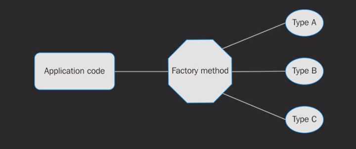

# Factory Pattern

- Creational pattern
- Caller does not create objects directly
- Factory function handles creation of new objects based n conditions

<h3> From Mastering Go Programming Course </h3>

<h3>Why use it?</h3>

- Code is easily expandable
- Separation of concerns
    -Troubleshoot locally
- Efficient team work

Automation

- Build a system that can control appliances
- Start an apliance
- Get a description of the appliance

