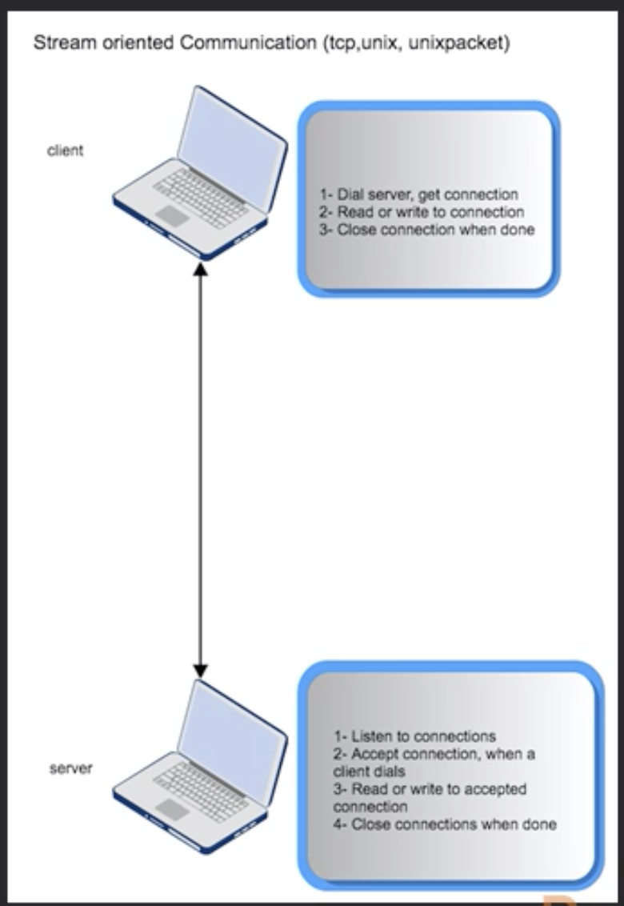
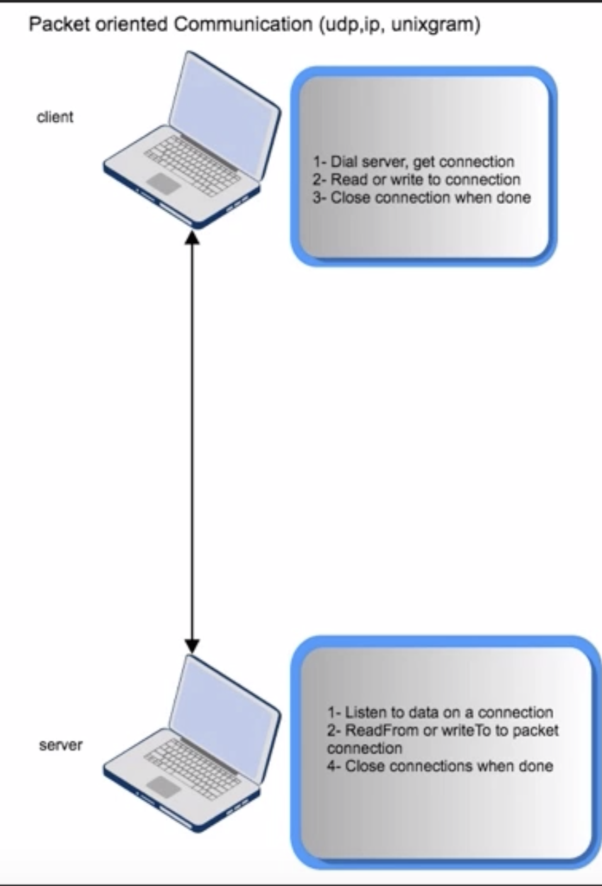

# TCP Communications

<table>
<tr>
<th align="left">

<h5>Client: </h5>

<ul class="left">
    <li> Dial function</li>
    <li> Conn interfaxe</li>
    <li> Conn reads and writes</li>
</ul>

<h5>Server:</h5>

<ul>
    <li> Listen function</li>
      Type Listener
        Accept()(Conn, error)
        Close() error
        Addr() Addr
    <li> Listener interface</li>
    <li> Listener.Accept</li>
    <li> Conn interface again</li>
</ul>

</th>
<th>

TCP Client-Server
</th>
</tr>
<tr>
<th align="left">

<h5>Client: </h5>

<ul class="left">
    <li> Dial function</li>
    <li> Conn interfaxe</li>
    <li> Conn reads and writes</li>
</ul>

<h5>Server:</h5>

<ul>
    <li> Listen function</li>
    <li> ListenPacket function</li>
    <li> PacketConn interface</li>
    <li> ReadFrom WriteTo functions</li>
</ul>

</th>
<th>

UDPClient-Server
</th>
</tr>
</table>

##Conn interface:

Supports:
 - ioreader interace / buffio interface
    Read(b []byte) (n int, err error)
- iowrite interface 
    Write(b []byte)(n int, err error)
- Close Interface
    Close() error

implemented by TCPConn type
Supports concurrency - multiple go routines can use the connection at the same time. 

## UDP 

One way; No handshakes
- Client Server
- Base64 Encoding

Packet Oriented

  
