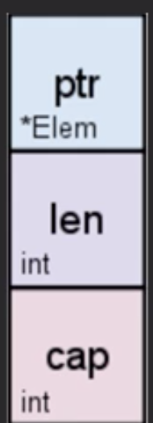
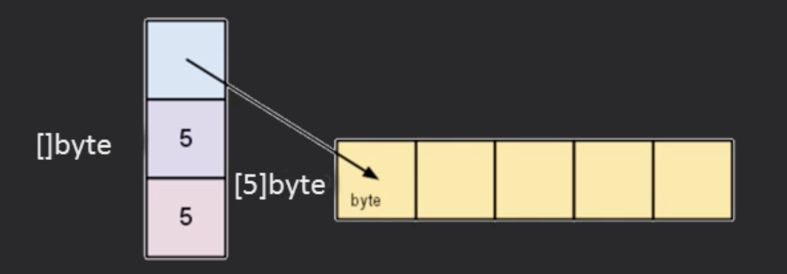
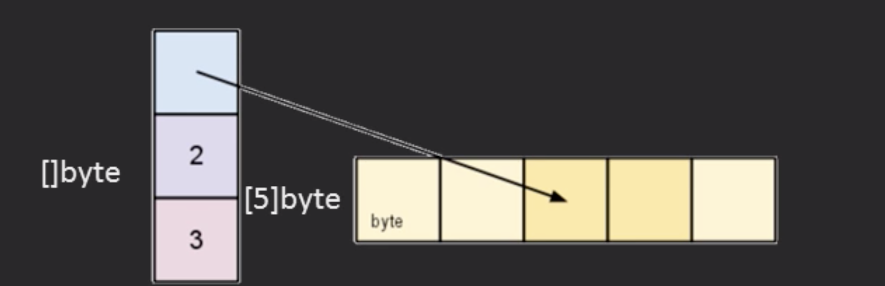

## Declaring a slice

- s := []int{3,4,5}     // Initialize with Values

- s := []int{}          // Initialize with no values, memory allocated

- var s []int           // declare but no allocated memory. 

- s := make([]int,5,10)  //Initialize with no value, alocate memory,
                         //Specify length and capacity of underlying array

Capacity is the length of the underlying array

s := make([]byte,5) or s:=make([]byte,5,5)
 

- slice[low:high]           // starts at the low index and ends at high-1 index
- s = s[2:4]

- len(s) =>3
- cap(s) =>3
- s=s[:cap(s)]

Slicing a slice retains the original capacity
 
 -   a=append(a[:i], a[j:]) // remove items
 - a = append(a[:i], a[i+1:]...) //remove one item 
 - Cut if the slice contains pointers

[subslice](3.1-6subslice.go)
<a href="./3.1-6subslice.go"><h1>./3.1-6subslice.go</h1></a>