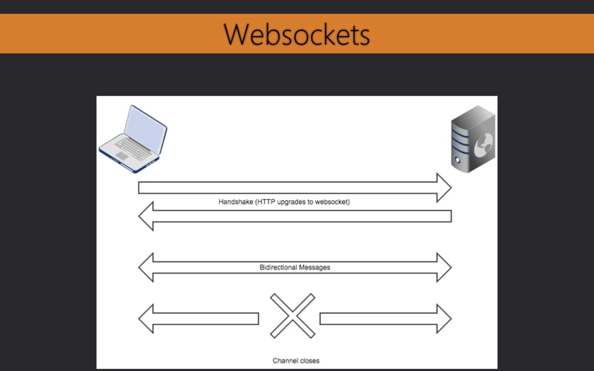

# Websockets

* Allow realtime commiunication

1. Handshake 
2. Response
3. Channel is then open between client and server until a close message is received. 

https://godoc.org/golang.org//net/websocket

//not part of the standard packages

